# Documentação de Componentes

Este documento descreve **visualmente** os diagramas principais do sistema **Vitta**.  

---

## 1) Visão Lógica

### Visão lógica
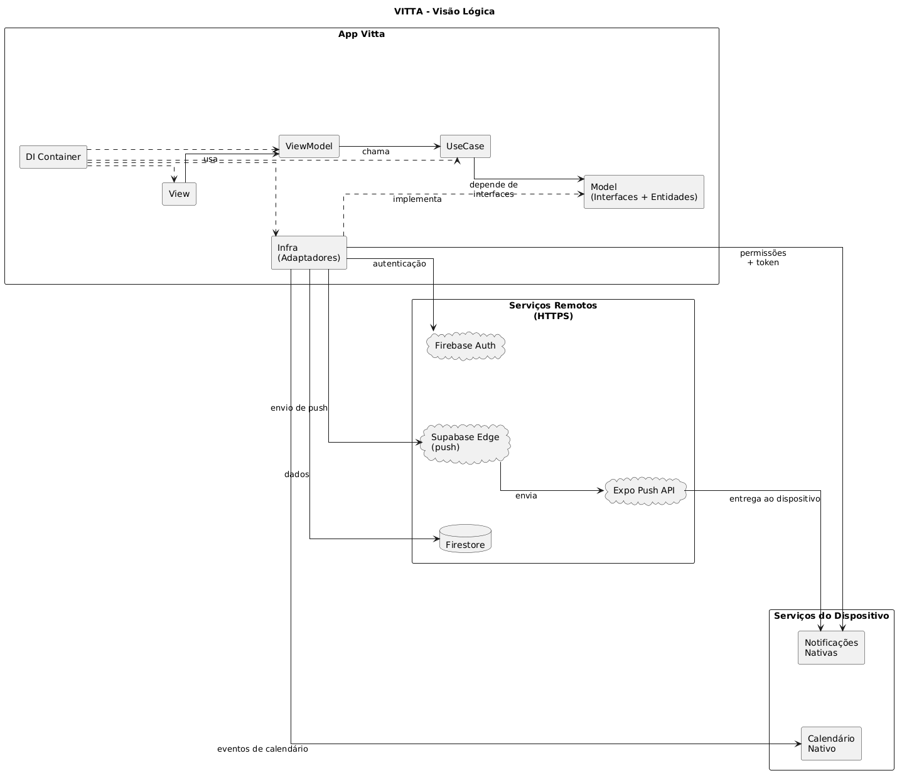

**Descrição visual:**  
O diagrama organiza o **App Vitta** em camadas e deixa explícitas as relações entre elas.  
No bloco “Camadas”, o **DI Container** aparece como ponto de composição, ligando a **View** e o **ViewModel**.  
A **View** consome ações e estado do **ViewModel** (seta “usa”).  
O **ViewModel** chama o **UseCase** (seta “chama”), e o **UseCase** depende das **interfaces** do **Model** (seta “depende de interfaces”).  
A **Infra (Adaptadores)** implementa essas interfaces (seta pontilhada “implementa”) e faz a integração com serviços externos.  
À direita, os serviços remotos mostram o fluxo de autenticação e dados: **Firebase Auth** e **Firestore**.  
O caminho de notificações segue: **Infra → Supabase Edge (push) → Expo Push API → Notificações nativas**.  
Na base, a comunicação com serviços do dispositivo mostra duas saídas diretas da Infra:  
**permissões + token** para notificações e **eventos** para o **calendário nativo**.

**Como os componentes se comunicam:**
- View -> ViewModel -> UseCase -> Model
- Infra **implementa** interfaces do Model
- Infra chama Firebase, Supabase e Expo Push
- Infra chama Calendário e Notificações nativas

---

## 2) Visão Física (Deployment)

### Visão física
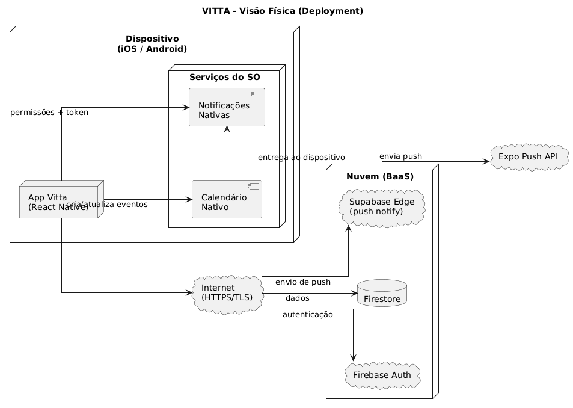

**Descrição visual:**  
O diagrama posiciona o **App Vitta** dentro do dispositivo (iOS/Android) e separa o que roda localmente do que roda na nuvem.  
À esquerda, o app cria e atualiza eventos no **Calendário nativo** e interage com **Notificações nativas**, incluindo o fluxo de **permissões + token**.  
No centro, o tráfego sai do dispositivo via **Internet (HTTPS/TLS)** e chega aos serviços remotos.  
À direita, a camada **Nuvem (BaaS)** concentra **Firestore** (dados), **Firebase Auth** (autenticação) e **Supabase Edge (push notify)**.  
O push segue para a **Expo Push API**, que entrega a notificação de volta ao dispositivo.  
O foco é mostrar a **topologia de execução** e o caminho físico das integrações.

---

## 3) Visão de Processos

Cada fluxo abaixo deve ser representado com um diagrama de sequência.

### 3.1 Login

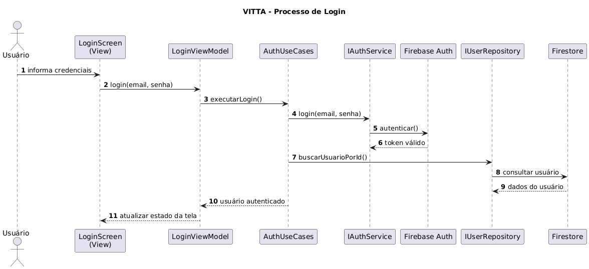

**Descrição visual:**  
O fluxo inicia na tela de login, passa pelo ViewModel e chega ao UseCase de autenticação.  
O UseCase valida credenciais, autentica no Firebase Auth e busca o perfil no Firestore.  
Com o usuário carregado, o ViewModel atualiza o estado e a View navega para a área logada.

### 3.2 Solicitar Consulta (Paciente)

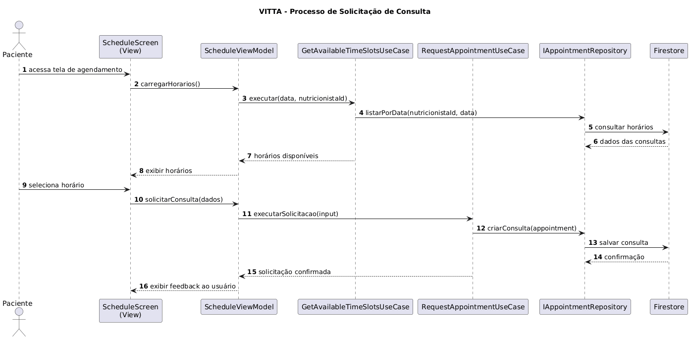

**Descrição visual:**  
O paciente carrega os horários disponíveis: o ViewModel chama o UseCase de disponibilidade,  
que consulta o repositório por data e filtra slots válidos (dia útil, horário futuro, sem conflito).  
Ao solicitar, o UseCase cria a consulta no Firestore com status **pending**  
e a View exibe o feedback de solicitação enviada.

### 3.3 Aceitar Consulta (Nutricionista)

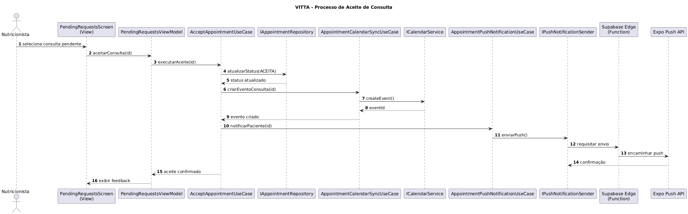

**Descrição visual:**  
O aceite parte da lista de pendências. O UseCase muda o status para **accepted**,  
sincroniza o evento no calendário e dispara push para o paciente via Supabase Edge + Expo Push.  
O ViewModel recebe o sucesso e atualiza a tela.

### 3.4 Cancelar e Reativar Consulta

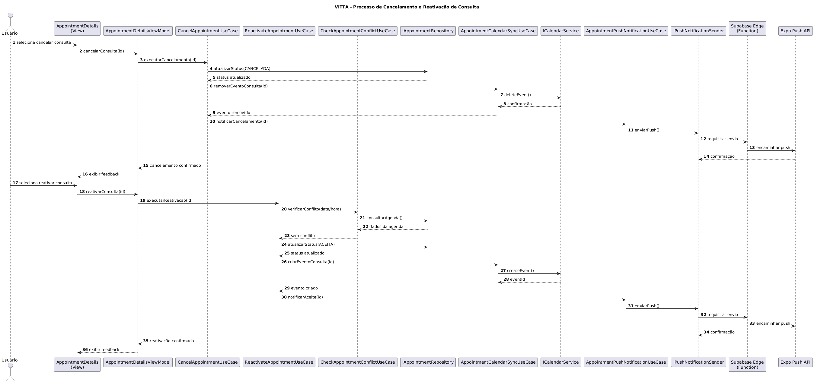

**Descrição visual:**  
No cancelamento, o UseCase altera o status para **cancelled**, remove o evento do calendário  
e envia notificação. Na reativação, o UseCase valida conflitos, aceita a consulta,  
cria o evento novamente e notifica as partes envolvidas.

### 3.5 Resolução de Conflitos

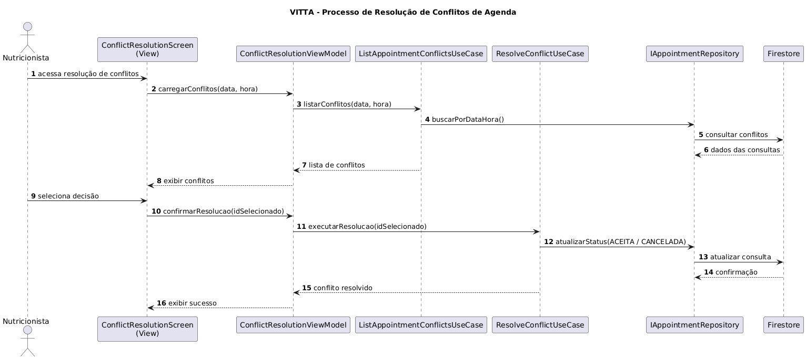

**Descrição visual:**  
Quando há conflito de horário, a tela carrega as consultas conflitantes via UseCase.  
Após a escolha, o UseCase resolve: mantém **accepted** a selecionada e cancela as demais,  
registrando as mudanças no Firestore e retornando sucesso para a View.

---

## 4) Diagrama de Classes (Domínio + Infra)

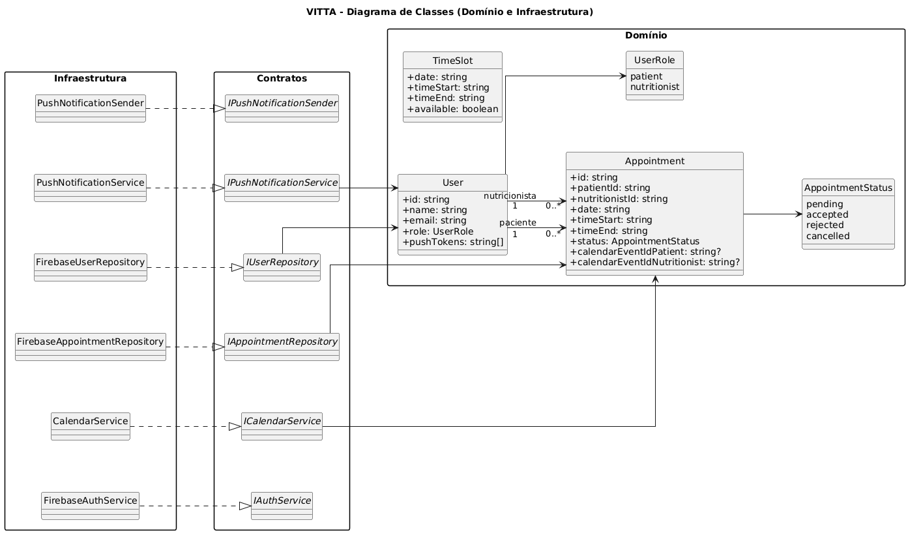

**Descrição visual:**  
Apresenta as entidades centrais (User, Appointment, TimeSlot) e o enum de estados.  
Mostra os contratos (interfaces) e as implementações na Infra (Firebase, Calendar, Push),  
e evidencia onde ficam os IDs de eventos do calendário e os tokens de push.

---

## 5) Diagrama de Interfaces (Contratos)

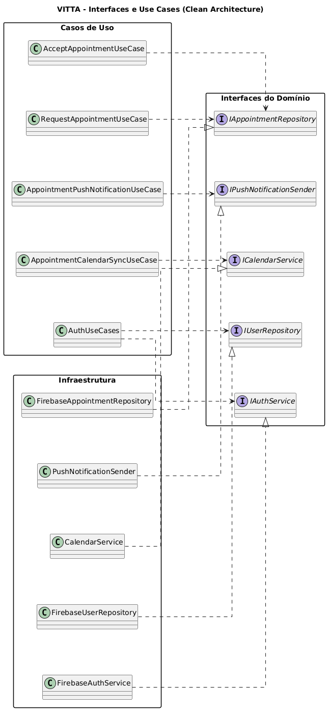

**Descrição visual:**  
Expõe quais UseCases dependem de quais interfaces e quem implementa cada contrato na Infra.  
O objetivo é deixar clara a inversão de dependências: regras de negócio conhecem somente abstrações.

---

## 6) Diagrama de Pacotes

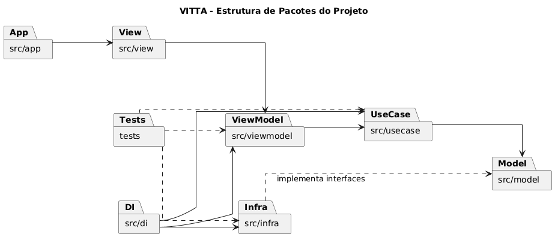

**Descrição visual:**  
Organiza o código por pacotes (app, view, viewmodel, usecase, model, infra, di, tests)  
e mostra a direção das dependências entre eles, com o DI como ponto de composição.

---

## 7) Diagrama de Estados (Consulta)

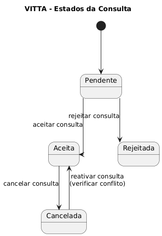

**Descrição visual:**  
Define o ciclo de vida de uma consulta: **pending → accepted/rejected**,  
**accepted → cancelled**, e reativação de **cancelled → accepted** mediante verificação de conflito.

---

## 8) Visão de Dependências

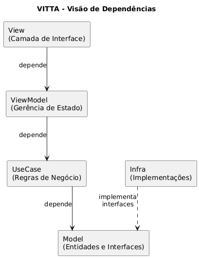

**Descrição visual:**  
Resume o empilhamento de camadas: View → ViewModel → UseCase → Model,  
com a Infra implementando interfaces do Model.  
Serve para reforçar o fluxo de dependências e o isolamento das regras de negócio.
